# 兔子波比5重制版 Engine 机制合同

本文定义 Engine 内部 `World / Mechanism / Entity` 三层的职责、跨层协议和机制组合方式。公开 Game API、时间推进及地图合同分别见 [`engine-api.md`](engine-api.md)、[`world-runtime.md`](world-runtime.md) 和 [`level-format.md`](level-format.md)。

## 目标与边界

Engine 接收一张纯语义 `LevelMap` 后，仍能独立完成地图内移动、碰撞、机关、计时、死亡和胜利判定。治理的目标是让新增机关明确回答：对象是什么、对外暴露什么语义、复用什么规则、有哪些专属行为，以及状态由谁保存。

目标结构是：

```text
Entity：具体对象的身份、实例状态、事实投影与规则组合
Mechanism：可复用的地图内游戏规则
World：时间、空间、调度、裁决、提交和快照
```

`Fact` 是 Entity 或 Presence 的只读语义投影；`Behavior` 是 World 调用规则代码的 hook 协议。二者都不是额外的运行时层级。`Fact` 的成立不会自动安装、卸载或调用 Behavior。

这项治理保持 `LevelMap` 的语义 JSON 合同，以及 Engine、Model、Editor、Adventure 的现有依赖方向。地图实例字段仍由 Model `EntityMapDefinition` 声明；具体规则和运行状态只在 Engine。Editor Play Test 继续把同一份 `LevelMap` 交给正式 Engine，Editor 草稿不接收运行时状态。

## 概念引用图

```mermaid
flowchart LR
  MAP["LevelMap Entity<br/>或 Runtime spawn"]

  subgraph ENTITY["Entity：具体对象"]
    DEF["EntityRegistry / EntityDefinition<br/>Type · footprint · Fact 声明<br/>机制组合 · 专属 Behavior"]
    INST["EntityInstance<br/>identity · anchor · gameplay state"]
    PRES["Presence<br/>cell · role · footprint part"]
    OWN["Entity 专属 Behavior"]
  end

  subgraph FACTS["Fact：只读语义接口"]
    FREG["FactDefinition / FactRegistry<br/>合法 ID 与语义"]
    RES["FactResolver<br/>静态声明 + 当前 state + Presence role"]
    EF["EntityFacts<br/>对象整体语义"]
    PF["PresenceFacts<br/>当前部位的空间语义"]
    QUERY["Fact Projection / Selector Index<br/>格子按 Presence · 对象按 ID 去重"]
  end

  subgraph MECHANISM["Mechanism：通用游戏规则"]
    MREG["MechanismRegistry<br/>MechanismId → 规则实现"]
    BOUND["Entity-bound Mechanism<br/>例如 Dialog / Collectible"]
    HOOKS["BehaviorRegistry / Effective hooks<br/>ID 查找 · 稳定顺序 · 去重"]
    PIPE["Pipeline Mechanism<br/>例如 Passage / Push"]
    PROPOSE["策略提案<br/>MovementPolicy / 通行判断"]
    COMMAND["命令请求<br/>状态变化 · spawn · 世界事件"]
  end

  subgraph WORLD["World：权威运行核心"]
    DISPATCH["Behavior dispatch<br/>按 Entity 与 Presence 调用"]
    STAGES["Movement pipeline<br/>固定阶段调用"]
    ADJ["裁决与计划<br/>边界 · busy · 预留 · 冲突<br/>最终 MovementPlan / MoveResult"]
    COMMIT["CommandQueue / MovementTransaction<br/>WorldCommitter 原子提交"]
    PROCESS["WorldMotion / RuntimeAction<br/>跨 Tick 过程状态"]
  end

  MAP -->|按 type 查定义| DEF
  MAP -->|初始化| INST
  DEF -->|初始化默认状态| INST
  DEF -->|定义 footprint| PRES
  INST -->|展开空间投影| PRES
  DEF -->|声明事实解析| RES
  INST -->|提供当前状态| RES
  PRES -->|提供 cell 与 role| RES
  FREG -->|校验 Fact 标识| RES
  RES --> EF --> QUERY
  RES --> PF --> QUERY

  MREG -->|提供实现| BOUND
  MREG -->|提供实现| PIPE
  DEF -->|显式组合| BOUND
  DEF -->|声明| OWN
  BOUND -->|提供 hook 实现| HOOKS
  OWN -->|提供 hook 实现| HOOKS
  DISPATCH -->|调用| HOOKS
  QUERY -.->|读取当前 Fact| HOOKS
  HOOKS -->|提出移动策略| PROPOSE
  HOOKS -->|请求 gameplay mutation| COMMAND

  STAGES -->|触发对象 hook| DISPATCH
  STAGES -->|统一调用| PIPE
  QUERY -.->|读取当前 Fact| PIPE
  PIPE -->|提出通用策略| PROPOSE
  PROPOSE -->|交由 World 汇总| ADJ
  STAGES --> ADJ
  ADJ -->|权威提交| COMMIT
  COMMAND -->|按 World phase 提交| COMMIT
  COMMIT -->|修改对象状态或位置| INST
  COMMIT -->|更新空间 Presence| PRES
  COMMIT -->|状态或结构变化后刷新语义投影| RES
  ADJ -->|启动移动过程| PROCESS
  COMMIT -->|启动或更新 Action| PROCESS
  PROCESS -->|后续语义移动 intent| STAGES
  PROCESS -->|marker hook| DISPATCH
  PROCESS -->|后续命令请求| COMMAND
```



读图时注意三种关系：

1. **语义分成两种投影。** Entity Definition 与实例状态形成 `EntityFacts`；具体 Presence 另形成 `PresenceFacts`。对象查询匹配 Type、Entity Fact 或任一 Presence Fact，并按 Entity ID 去重；通行与碰撞读取当前格的 Presence Fact，格子 Selector 还可匹配候选对象的 Type 或 Entity Fact。
2. **规则按调用位置进入 World。** Entity-bound Mechanism 由 Entity 显式组合，通过 Behavior hook 执行；Pipeline Mechanism 由 World 在固定阶段统一调用。Passage 解释 `walkable`、`blocking`，Push 解释 `pushable`。World 只解释运行协议列明的 kernel Fact，例如经审计确认需要的 `player`。
3. **变化由 World 提交。** Mechanism 与对象 Behavior 提出策略、判断或命令请求；World 对移动提案完成裁决、冲突检查与计划构建，并按 phase 提交命令。提交后的状态重新派生 Fact，后续阶段读取更新后的投影。

## 三层职责

| 层 | 拥有 | 提供给其它层 |
| --- | --- | --- |
| World | EntityStore、SpatialIndex、WorldClock、MovementPlan 裁决、WorldMotion、RuntimeAction 调度、CommandQueue 提交、Snapshot、Outcome、WorldDelta | 只读查询、移动与命令协议、确定性生命周期 |
| Mechanism | 多种 Entity 可复用的通行、推、收集、对话等规则 | 策略提案或 Behavior hook 实现 |
| Entity | 稳定类型、地图初始化、实例 gameplay 状态、footprint、Fact 投影、所组合的 Mechanism、对象专属 Behavior、视觉定义 | 当前 Entity/Presence 语义及专属规则 |

World 承载、查询和传递 Fact，但只解释其运行协议明确列出的 kernel Fact。`player` 是 ActorLifecycle 确需识别时的候选，具体清单在语义审计阶段确认并逐项说明用途。`walkable`、`blocking` 由 Passage Mechanism 解释，`pushable` 由 Push Mechanism 解释；普通 gameplay Fact 的语义归消费它的 Mechanism。World 接收 Mechanism 与 Entity Behavior 的提案，负责边界、busy、目的格预留、多人冲突、移动参与者一致性、权威 `MoveResult` 和原子提交。

Mechanism 通过 World 的只读查询与提案/命令协议工作。Entity 专属 Behavior 可以理解具体对象类型；通用 Mechanism 不能以具体 Entity Type 判断它是否适用。World 核心也不应导入具体对象实现。当前 `World.ts` 中的内置注册表接线和 Bobby 专属库存处理，需要在相应迁移阶段转移到 Engine 的组合入口或对象规则中；公开的 `Game.loadLevel(LevelMap)` 使用方式保持简单。

源码依赖目标：

```text
World 定义协议与执行器
Mechanism 依赖 World 协议，实现通用策略
Entity 依赖 World 协议与 Mechanism 定义，组合对象规则
Engine 组合入口装配内置 Registry，再创建 World
Presentation 只读 World 事实、WorldDelta 与对象视觉定义
```

目录是职责的结果。优先在 `engine/src/world/` 保留运行时协议和裁决器，在 `engine/src/mechanism/` 放通用规则，在 `engine/src/entities/` 放对象组合与特例；不为目录形状机械搬迁职责清楚的代码。

## Entity 状态与初始化

`LevelEntity` 顶层字段描述开局配置。Loader 和 Runtime spawn 都通过所属 Entity 的初始化规则创建 runtime 对象；字段可以初始化 gameplay state，也可以作为仅需长期读取的配置留在实例中。无需为每个字段固定保存两份相同的值。

例如 `pressed`、`raised` 在地图中是初始值，运行中可变化的当前值属于 Entity state。`channel`、`requireKey`、`deathCountdownSeconds` 等字段是否保留为独立只读配置，按对象行为的实际读写需求决定。Runtime spawn 应走与地图加载一致的默认值及字段验证路径；必要的运行时专属输入由 Engine Definition 声明。

Entity gameplay 状态只通过 World 的正式 mutation 路径提交，进入 Snapshot、Undo 和 Replay。跨 WorldTick 的过程进度归 RuntimeAction；格间运动及 marker 进度归 WorldMotion；ActorLifecycle、Outcome 和全局计数归各自 World runtime 对象。Mechanism 不保存共享的可变 gameplay 数组或计数器。

对 Behavior 和 Mechanism 暴露的 Entity、Presence、Fact 查询必须是只读视图。TypeScript `Readonly<T>` 只约束类型表面，不能代替运行时引用隔离；实现时要保证调用方无法沿 `query.entity()` 返回值修改 EntityStore。Mutation 在 CommandQueue 收集，按 World 定义的 phase 提交。

## Fact 合同

Fact 表示当前 Entity 或其某个 Presence 对其它 Engine 系统公开的稳定语义。Fact 有正式 ID 和定义，可以被 World 查询、Mechanism、Selector 与 Debug 使用。Fact 是派生值，不单独保存，也没有 `setFact`、`addFact` 或 `removeFact` gameplay 命令。

第一阶段只实现布尔 Fact。注册表中的每个 Fact 必须有唯一 ID 和中文语义说明；使用未知 Fact ID 时在内置定义校验阶段报错。未来确有跨对象数值规则时，再为 Fact Definition 增加值类型与单位，当前 API 命名不预设所有 Fact 永远是布尔量。

Fact 分为 `EntityFacts` 和 `PresenceFacts` 两种只读投影。前者描述对象整体语义，后者描述某个空间部位在当前格子的语义；两者可分别来自 Entity Definition 的静态声明、Entity 初始配置和当前 Entity state，Presence Fact 还可依赖 role/footprint。解析函数只读取所属 Entity，Presence 解析另可读取当前 Presence；跨对象条件留给运行规则判断。这个局部性让受影响 Fact 投影可以按 Entity 刷新。

```ts
interface EntityFactResolveContext {
  readonly entity: Readonly<EntityInstance>;
}

interface PresenceFactResolveContext extends EntityFactResolveContext {
  readonly presence: Readonly<EntityPresence>;
}

interface EntityFactDefinition {
  readonly staticEntityFacts?: readonly FactId[];
  readonly resolveEntityFacts?: (
    context: EntityFactResolveContext,
  ) => readonly FactId[];
  readonly staticPresenceFacts?: readonly FactId[];
  readonly resolvePresenceFacts?: (
    context: PresenceFactResolveContext,
  ) => readonly FactId[];
}
```

这段形状表达读取边界，具体类型随实现与现有 `EntityDefinition` 整合。Resolver 应集中验证 ID、去重并返回有效 Fact；业务代码不维护第二套类型字符串判断。机制组合本身也不应默认为 Entity 增加 Fact。只有当某个机制的存在必然带来稳定语义、且存在实际查询使用方时，才在 Entity Definition 中明确声明该 Fact。

### Presence 与 Entity 查询

格子上的通行、碰撞和触发以该格 Presence Fact 为准。多格 Dragon 的 head/body 可以 `blocking`，tail 可以 `walkable`；同一 Entity 的各 Presence 不必拥有同一组 Fact。整体语义保存在 Entity Fact 中，例如 Carrot 的 `collectible-object`、Dragon 的 `boss`；它们无需复制到每个 Presence。

Entity 级 Fact 查询命中 `EntityFacts(entityId)` 或任一当前 `PresenceFacts(presence)`，并按 Entity ID 去重。这适合关卡计数和候选集合；它不能代替格子级查询。格子查询使用该格的 Presence Fact，不把另一部位的 Fact 扩散到这里。Type Index 与 Fact Index 存 Entity ID，Fact Index 是两种投影的并集；格子查询保留当前 Presence 身份。索引结果按 Entity ID 排序，避免移动重插入改变 Replay 顺序。

### 刷新与快照

World 提供唯一的 Entity semantic projection 刷新入口。一次状态提交后，先根据已提交的 Entity state 重算该 Entity 的 Entity Fact 与全部 Presence Fact，再同步 Type/Fact Index 和格子投影；后续 phase 才能读到新结果。刷新覆盖加载、spawn、destroy、替换、状态变化、移动、方向/footprint 重建和 Snapshot restore。Restore 可以全量重建派生索引，普通 mutation 只处理受影响 Entity。

`WorldMotion` 的 source/target Presence 快照保留本次移动的格子、role 与调度身份；marker 执行时的有效 Fact 应从当时已提交的 Entity state 解析。该 marker 内新排队的命令在提交后才改变后续查询。迁移时须用回归测试固定这一读取时点，避免运动途中状态变化使触发结果依赖缓存 Trait。

### 初始分类样例

| 当前用法 | 目标归属 | 判断依据 |
| --- | --- | --- |
| `blocking`、`walkable`、`pushable` | Fact | 被通用通行或推规则查询 |
| `player` | 待审计的 kernel Fact | ActorLifecycle 确需直接识别时由 World 协议列明 |
| `filled-egg` | 从 Egg state 派生的 Fact | `fill-all` 查询当前填充结果 |
| `dialog` Trait 的行为分发 | Entity-bound Dialog Mechanism | 通用触碰对白规则 |
| `mower-conditional-overlay` | 具体对象 Behavior | 含割草机专属通行设计 |
| `stateful-block` | Color Block 规则及必要的动态 Fact | `raised` 是对象状态，通行还需保持现有行为 |

这张表只是迁移起点。完整审计须逐项记录定义、查询、分发、是否随 state 变化、是否与特定 Entity 耦合，以及迁移后的唯一归属。

## Selector 合同

Engine 内部使用带类型的 Selector，区分 `type` 和 `fact`。`LevelMap.rules.win` 的 `target`、`filler` 继续是字符串，沿用当前“同名 Entity Type 或 Trait 命中”的并集语义。迁移后，Entity 级匹配是 Type、Entity Fact、任一 Presence Fact 的并集，按 Entity ID 去重，不采用优先级判定。

```ts
type EntitySelector =
  | { readonly kind: "type"; readonly value: EntityType }
  | { readonly kind: "fact"; readonly value: FactId }
  | {
      readonly kind: "any";
      readonly selectors: readonly EntitySelector[];
    };
```

`collect-all` 按 Entity 去重计数；`fill-all` 先找到目标 Presence 所在格，再在对应格判断 filler：Type 或 Entity Fact 可命中该格的候选 Entity，Presence Fact 只检查该格 Presence，不借用同一对象其它格子的 Fact。`reach` 还要保留目标 Behavior 的 `canReach` 和多玩家聚合语义。`lastReachedSelectors` 的记录与恢复也必须保持当前规则结果。Editor 的规则检测和提示通过 Engine authoring API 获取同一语义，不维护独立的 Fact/Selector 解释器。

## Mechanism 的两种调用方式

Mechanism 只有一层“通用规则”语义，按触发位置使用两种调用方式；第一阶段无需建立复杂的继承体系。两种方式都由明确的注册与校验入口装配，执行顺序不能取决于模块加载顺序。

**Pipeline Mechanism** 在 World 的固定 gameplay 阶段统一调用，处理多个对象共同参与的规则。例如标准通行使用当前 Presence 的 `walkable`、`blocking`；Push 读取目标的 `pushable` 并提出附带移动者。Pipeline Mechanism 不属于某个箱子或 Bobby，Entity 只暴露供规则判断的 Fact。

**Entity-bound Mechanism** 由 Entity Definition 显式组合，复用现有 `Behavior` hook 协议。例如 Dialog 可为多个带字面对白的对象处理触碰与游标；Collectible 可承担各类对象共同的收集动作。Entity 自己的特殊 Behavior 与所组合机制的 Behavior 一起形成稳定、有序、去重的有效 Behavior 列表。

Mechanism Registry 记录 ID 与实现，Engine 的组合入口另外提供显式排序的 Pipeline Mechanism 列表；`EntityDefinition.mechanisms` 只引用 Entity-bound Mechanism。初版定义只容纳实际使用的 hook、Behavior ID 与必要的校验信息，不预先建立脚本系统、地图持久化机制 ID 或可变机制实例。

下列关系是两个独立方向：

```text
Entity / Presence → Fact Resolver → Fact Query
Entity → Entity-bound Mechanism → Behavior hook
World movement phase → Pipeline Mechanism → policy proposal
```

Fact 查询会影响规则的判断结果；Fact 自身不参与 Behavior dispatch，也不会自动决定某个 Entity 是否安装 Mechanism。动态 Fact 更新后，已经组合的行为在下次 hook 中读取新的有效值。

## Pipeline 移动合同

Pipeline Mechanism 只提出 gameplay policy。World 拥有最终裁决权和提交权：它汇总 actor 的 `MovementPolicy`、Pipeline 提案和目标 Entity hook 的结果，验证边界、busy、目的格预留、多人冲突及参与者一致性，形成权威移动结果，再原子提交所有参与者及命令。

```text
语义 MoveIntent
  → World 检查 Actor、World 状态与基础目的格
  → Actor Behavior 提出 MovementPolicy
  → World 校验该基础 policy
  → standard passage 的固定 Pipeline 阶段提出规则结果
  → World 汇总并完成所有参与者的最终校验
  → 单个 MovementTransaction 原子提交
  → WorldMotion marker、Entity hook、目标与终局规则
```

`unrestricted` passage 已表示 Actor 规则完成其领域判定；它沿当前合同跳过标准地形通行与 Push Pipeline，但仍接受 World 的边界、busy、预留、参与者与原子提交校验。任何新 Pipeline hook 都必须声明自己是否属于 standard passage，不能无条件遍历全局规则列表。

标准通行内部的关键顺序如下，迁移前先用测试固定：

```text
来源格 canLeave
→ Push 候选及目标格可占用性
→ 目标格 walkable 判断
→ 目标格 resolveEntry
→ 目标格 canEnter 与 blocking 裁决
→ 最终预留与原子提交
```

`resolveEntry` 可能在同一事务中提出 `clear-and-pass` 命令；目标 Presence 的 `canEnter` 可显式允许或拒绝通行。因此 Passage Mechanism 不能只做一次 `blocking` 布尔检查，也不能提前提交清除命令。Pipeline 可返回只读的决策、原因、附带移动者或应从目标交互栈排除的 Presence 身份；World 将其并入当前 `MovementTransaction`。精确 TypeScript 形状在迁移 Push 时由测试和现有 `MovementPolicy` 决定，不另开直接写 EntityStore 的路径。

Push 的具体行为要求：

- Push Mechanism 查找目标格 `pushable` Presence，按当前稳定堆叠顺序选择候选，并提出被推物的目标格与移动原因；
- World 检查被推物能否占用目的格以及整组预留是否冲突；
- 被推物与 Actor 的移动同属一次事务，被推物离开目标格后，Actor 的目标交互栈按同一事实裁剪；
- 失败时继续产生当前约定的阻挡与 `onTouch` 结果，成功时保留 WorldMotion、marker、Replay 和 Undo 语义；
- Mechanism 不调用 `commands.move()` 绕过 World 的移动裁决，也不先提交箱子再移动 Actor。

`MovementPlan` 仍是 World 规范化并裁决的结果。现有代码在生成 Actor 计划后才进入 Push 判定；因此迁移时 Pipeline 先提交候选或参与者提案，World 再形成可提交的最终计划，不要求 Push 在现有 `createMovementPlan()` 调用点直接返回完整计划。

Pipeline 的注册顺序、阶段顺序和同阶段冲突规则应显式声明。两个机制若提出互斥 passage 判断或不同的同一参与者位置，World 应以确定性错误或既定优先级处理；不能依赖 `Set` 迭代、对象属性顺序或注册竞态。

## Entity-bound Behavior 合同

`Behavior` 保持 `planMovement`、`resolveEntry`、`canEnter`、`canLeave`、`canReach`、`onTouch`、`onEnter`、`onLeave`、`onArrive`、`onTick` 等现有 hook。它是调用协议；Behavior ID 查找只负责取得实现。

有效 Behavior 列表由 Entity Definition 的显式 Behavior 与其 Entity-bound Mechanism 的 Behavior 按约定顺序组成，重复 ID 只执行一次。迁移前记录当前各关键 Entity 的 hook 顺序；迁移后在 `BehaviorRuntime`、`TickIndex`、`ReachResolver`、初始化和销毁路径使用同一解析入口。Tick 候选仍在 phase 开始时按 Entity ID 取样，当次新增 Entity 从下一次 tick phase 参与。

一个行为只适用于 body 或其它特定 Presence 时，通过 Presence role 和 Entity 的真实结构判断。Entity 级 Mechanism 组合不意味着所有 footprint 部分具有相同 Fact 或触发同样的交互。Dragon head/body/tail 的阻挡与触发差异必须保留。

`behaviorLibrary` 中共享流程与对象特例应分开。当前 Collectible 处理 Carrot 与 Mower 的组合特例；通用收集机制只负责多种 Entity 共同的收集步骤，Carrot 的额外实体生成和割草机限制放回适当的 Entity 专属规则。Dialog 的通用触碰与游标逻辑适合作为第一个 Entity-bound 样板；对话文本和游标仍属于各对象的实例数据及 Entity state。

## 视觉与 authoring

Presentation 使用 WorldDelta、WorldMotion、Entity state 和只读 Fact 选择画面；World 与 Mechanism 不读取 `VisualRuntime`、`PresentationClock`、Renderer、Canvas 或 DOM。仅影响 sprite、位移插值、闪烁、粒子与镜头的状态由 Presentation 持有。会改变碰撞、可攀爬时点或动作结果的过程继续由 WorldClock 上的 Entity state、RuntimeAction 或 WorldMotion 表示。

不能仅按 `variant` 字段名判断归属。原版 Surface 的某些 atlas variant 对应不同地图内语义；Carousel 的 `variant` 影响通行方向，Mirror 的 `variant` 参与机关结果。迁移逐项判断：纯视觉字段继续由既有地图字段和 Visual Definition 使用，具有 gameplay 含义的值留在对象状态或初始配置并投影必要 Fact。稳定地图字段不因内部分类而改名。`ts.png` / `ta.png` 坐标继续由 Model 的 semantic atlas mapping 提供，DAT byte 换算仍只在 `tools/original/dat/`。

Editor Palette、Inspector、规则检测与 Play Test 通过 Engine authoring API 获取 Entity Fact、Mechanism 和 Behavior 元数据；Editor 不实现碰撞、推、机关或 FactResolver 的第二份规则。未知 Entity 或字段无效的占位实例仍保持可见和惰性，不获得有效 Fact 与 Behavior。

## 分阶段实施

每个阶段形成可审查、可回滚的独立 commit；完成该阶段相关检查后再提交。跨模块、公共合同、Engine gameplay 和构建检查的阶段运行完整 `npm run verify`；整个任务最终也运行完整验证。验证中的浏览器测试按仓库流程在沙箱外启动。

1. **语义审计与基线。** 枚举全部 `traits`、`instanceTraits`、`bindTrait`、查询和行为绑定，记录每个 ID 的用途及目标归属；补足 Push、通行、`clear-and-pass`、多格 Presence、Egg 填充、Carrot 收集、Tick 顺序和 Replay/Snapshot 的关键回归。
2. **Fact 投影与 Selector。** 建立 Fact Definition、Resolver、Entity/Presence 两种投影和索引刷新；同时处理静态与动态 Fact。将内部查询逐步切为 typed Selector，保持 `LevelMap` 字符串的 Type/Fact 并集语义。此阶段保留现有 Behavior dispatch，便于隔离结果差异。
3. **Entity-bound Mechanism。** 注册简明机制定义，先迁移 Dialog 等通用样板。统一有效 Behavior 解析，覆盖初始化、移动、Reach 和 Tick；按稳定顺序拆除 Trait 自动分发。具体对象特例归回 Entity。
4. **Pipeline Mechanism。** 固定 standard passage 的阶段与提案合同，先迁 Push，再迁 Passage。World 保持完整校验、最终 `MovementPlan`、单事务提交、WorldMotion 与结果结算；`unrestricted` 的作用范围保持现有语义。
5. **Presentation、Editor 与文档。** 校正字段分类和 Inspector 展示；更新正式架构、世界运行时、Engine API、Editor 与新增机关流程；将可机械验证的注册、依赖和分发规则加入 `npm run verify`。

第 2～4 阶段的提交须包含对应的最小回归测试。行为依据尚未确认的原版机关先记录为推断，并按 [`新增 / 校正机关流程`](../workflows/add-mechanic.md) 用 Editor 最小地图与原版 JAR 验证。

## 自动门禁与验收

`npm run verify` 应覆盖可机械判断的边界：所有 Fact/Mechanism/Behavior 引用均已注册，ID 不重复；World 对 Fact 的直接语义分支仅使用协议登记的 kernel Fact；Gameplay Behavior dispatch 不使用 `bindTrait`；`engine/src/world/` 不导入 `engine/src/entities/` 的具体规则或 `engine/src/visual/` 的 Presentation runtime；通用 Mechanism 不导入具体 Entity 模块、Original DAT tooling 或浏览器产品模块。新增规则检查与代码迁移应在同一阶段提交。

回归至少证明：

- 官方与自定义地图的 `collect-all`、`fill-all`、`reach` 和多玩家聚合结果保持一致；
- 同一字符串可同时命中 Type、Entity Fact 与 Presence Fact；只有 Entity Fact 的对象也可被查到，Entity 计数去重，Presence 格子判断不借用其它部位的 Fact；
- Entity state、spawn、destroy、方向变化与 Snapshot restore 后的 Fact 查询无过期结果；
- Push 成功、阻挡、目的格冲突、多人竞争和移动中的触发按固定顺序产生同样的 WorldDelta 与 `MoveResult`；
- Entity-bound Mechanism 在至少两种无关 Entity 上复用，特定对象 Behavior 保持原有交互；
- WorldMotion marker、RuntimeAction、Undo、Replay 在相同地图和输入序列下保持确定性；
- Editor Play Test 与普通单图加载共享同一 Engine 规则，草稿保持原样。

完成后的新增机关流程是：确定 Entity Type 与地图字段；分别声明对象整体与各 Presence 的必要 Fact；选择已有通用 Mechanism 或实现对象专属 Behavior；需要跨对象复用的新规则进入 Mechanism；状态通过对应 runtime owner 保存，所有实际变化经 World 裁决和提交。Fact 描述当前语义，Mechanism 提出规则，World 形成权威结果。
