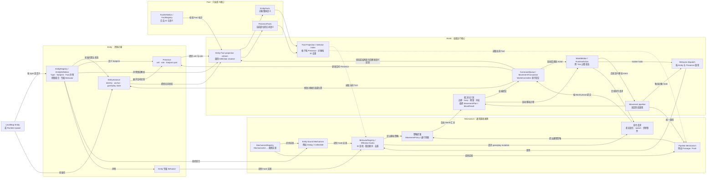

# 兔子波比5重制版 Engine 机制合同

本文定义 Engine 内部 `World / Mechanism / Entity` 三层的职责、跨层协议和机制组合方式。公开 Game API、时间推进及地图合同分别见 [`engine-api.md`](engine-api.md)、[`world-runtime.md`](world-runtime.md) 和 [`level-format.md`](level-format.md)。

## 目标与边界

Engine 接收一张纯语义 `LevelMap` 后，仍能独立完成地图内移动、碰撞、机关、计时、死亡和胜利判定。治理的目标是让新增机关明确回答：对象是什么、对外暴露什么语义、复用什么规则、有哪些专属行为，以及状态由谁保存。

运行结构是：

```text
Entity：具体对象的身份、实例状态、事实投影与规则组合
Mechanism：可复用的地图内游戏规则
World：时间、空间、调度、裁决、提交和快照
```

`Fact` 是 Entity 或 Presence 的只读语义投影；`Behavior` 是 World 调用规则代码的 hook 协议。二者都不是额外的运行时层级。`Fact` 与 `Mechanism` 平级：Entity 产出 Fact，Mechanism 消费，World 维护投影、查询和索引。`Fact` 的成立不会自动安装、卸载或调用 Behavior。

这项治理保持 `LevelMap` 的语义 JSON 合同，以及 Engine、Model、Editor、Adventure 的现有依赖方向。地图实例字段仍由 Model `EntityMapDefinition` 声明；具体规则和运行状态只在 Engine。Editor Play Test 继续把同一份 `LevelMap` 交给正式 Engine，Editor 草稿不接收运行时状态。

## 概念引用图



读图时注意三种关系：

1. **语义分成两种投影。** Entity Definition 与实例状态形成 `EntityFacts`；具体 Presence 另形成 `PresenceFacts`。对象查询匹配 Type、Entity Fact 或任一 Presence Fact，并按 Entity ID 去重；通行与碰撞读取当前格的 Presence Fact，格子 Selector 还可匹配候选对象的 Type 或 Entity Fact。
2. **规则按调用位置进入 World。** Entity-bound Mechanism 由 Entity 显式组合，通过 Behavior hook 执行；Pipeline Mechanism 由 World 在固定阶段统一调用。Passage 解释 `walkable`、`blocking`，Push 解释 `pushable`。World 只解释运行协议列明的 kernel Fact，例如经审计确认需要的 `player`。
3. **变化由 World 提交。** Mechanism 与对象 Behavior 提出策略、判断或命令请求；World 对移动提案完成裁决、冲突检查与计划构建，并按 phase 提交命令。提交后的状态重新派生 Fact，后续阶段读取更新后的投影。

## 三层职责

| 层 | 拥有 | 提供给其它层 |
| --- | --- | --- |
| World | EntityStore、SpatialIndex、WorldClock、MovementPlan 裁决、WorldMotion、RuntimeAction 调度、CommandQueue 提交、Snapshot、Outcome、WorldDelta | 只读查询、移动与命令协议、确定性生命周期 |
| Mechanism | 多种 Entity 可复用的通行、推、收集、对话等规则 | 策略提案或 Behavior hook 实现 |
| Entity | 稳定类型、地图初始化、实例 gameplay 状态、footprint、Fact 投影、所组合的 Mechanism、对象专属 Behavior、视觉定义 | 当前 Entity/Presence 语义及专属规则 |

World 承载、查询和传递 Fact，但只解释其运行协议明确列出的 kernel Fact。`player` 是 ActorLifecycle 确需识别时的候选，具体清单在语义审计阶段确认并逐项说明用途。`walkable`、`blocking` 由 Passage Mechanism 解释，`pushable` 由 Push Mechanism 解释；普通 gameplay Fact 的语义归消费它的 Mechanism。World 接收 Mechanism 与 Entity Behavior 的提案，负责边界、busy、目的格预留、多人冲突、移动参与者一致性、权威 `MoveResult` 和原子提交。

Mechanism 通过 World 的只读查询与提案/命令协议工作。Entity 专属 Behavior 可以理解具体对象类型；通用 Mechanism 不以具体 Entity Type 判断它是否适用。World 核心只依赖通用 Entity ID、状态和 Presence 协议，不导入具体对象实现。Engine 的组合入口装配内置 Registry 与 Bobby Actor Policy；公开的 `Game.loadLevel(LevelMap)` 使用方式保持简单。

源码依赖目标：

```text
World 定义协议与执行器
Fact 定义独立的共享语义标识与注册表
Mechanism 依赖 World 协议，实现通用策略
Entity 依赖 World 协议、Fact 与 Mechanism 定义，组合对象规则
Engine 组合入口装配内置 Registry，再创建 World
Presentation 只读 World 事实、WorldDelta 与对象视觉定义
```

目录是职责的结果。`engine/src/world/` 保存运行时协议和裁决器，`engine/src/fact/` 保存共享语义标识，`engine/src/mechanism/` 保存通用规则，`engine/src/entities/` 保存对象组合与特例。

## Entity 状态与初始化

`LevelEntity` 顶层字段描述开局配置，在 Engine 加载边界初始化 runtime 对象。运行中由 Entity 规则请求生成的对象使用 `EntitySpawnSpec` 明确给出初始状态；字段可以初始化 gameplay state，也可以作为仅需长期读取的配置留在实例中。无需为每个字段固定保存两份相同的值。

例如 `pressed`、`raised` 在地图中是初始值，运行中可变化的当前值属于 Entity state。`channel`、`requireKey`、`deathCountdownSeconds` 等字段是否保留为独立只读配置，按对象行为的实际读写需求决定。运行时专属生成参数留在 Engine 的 `EntitySpawnSpec`，不进入 `LevelMap`。

Entity gameplay 状态只通过 World 的正式 mutation 路径提交，进入 Snapshot、Undo 和 Replay。跨 WorldTick 的过程进度归 RuntimeAction；格间运动及 marker 进度归 WorldMotion；ActorLifecycle、Outcome 和全局计数归各自 World runtime 对象。Mechanism 不保存共享的可变 gameplay 数组或计数器。

对象专属 Behavior 可以读取所属 Entity 的具体 state 字段，并通过 World 命令请求修改；它无需为自身使用的私有状态创建 Fact。通用 Mechanism 依赖 Fact 与通用 World Query 判断规则，不依赖具体 Entity 的私有 state 结构。

对 Behavior 和 Mechanism 暴露的 Entity、Presence、Fact 查询必须是只读视图。TypeScript `Readonly<T>` 只约束类型表面，不能代替运行时引用隔离；实现时要保证调用方无法沿 `query.entity()` 返回值修改 EntityStore。Mutation 在 CommandQueue 收集，按 World 定义的 phase 提交。

## Fact 合同

Fact 表示当前 Entity 或其某个 Presence 对其它 Engine 系统公开的稳定语义。Fact 有正式 ID 和定义，可以被 World 查询、Mechanism、Selector 与 Debug 使用。Fact 是派生值，不单独保存，也没有 `setFact`、`addFact` 或 `removeFact` gameplay 命令。

Fact 只投影值得跨 Entity 或跨 Mechanism 共享的语义，不逐字段镜像 Entity state；仅供对象专属 Behavior 使用的运行时数据留在所属 Entity state 中。

Fact Definition/Registry 只定义标识与语义，不依赖 Entity Definition、实例或具体对象类型。各 Entity Definition 声明自身的解析函数；World 的投影刷新器调用这些函数、校验标识并维护索引。通用 Mechanism 只通过 World 的只读查询协议读取 Fact，不导入具体 Entity 实现。

当前 Fact 表示布尔语义。注册表中的每个 Fact 有唯一 ID 和中文语义说明；内置静态声明与运行时 Resolver 使用未知 Fact ID 时会报错。跨对象数值结果由 World Metrics Mechanism 投影为通用指标。

内置 Fact 的生产方、消费方及状态来源如下；具体对象身份和私有状态由所属 Entity 规则直接读取：

| Fact | 生产方 | 消费方 | 随 state 变化 |
| --- | --- | --- | --- |
| `blocking` | Bobby、障碍对象及 Egg 等 Presence | Passage、对象进入裁决 | Egg 等对象会变化 |
| `climbable` | Beanstalk 各攀爬部位 | Bobby 攀爬姿势与动作 | 否 |
| `moving-platform` | Cloud、Leaf | Bobby 与 Mower 的移动关系判断 | 否 |
| `player` | Bobby | World ActorLifecycle、移动冲突及对象规则 | 否 |
| `pushable` | 可推动对象 | Push、`pushGoal` | 否 |
| `sky` | Starfield、Moon | Cloud 路线 | 否 |
| `walkable` | 可落脚地形及可承载部位 | 标准 Passage | 否 |
| `water` | Water、Waterfall 等水域 | Bobby 水域规则、Leaf 路线 | 否 |

Bean 的生长目标由 `beanCanGrowAt` 按语义地形与普通对象占用判断。Cloud / Leaf 另按对象阻挡名单和方向规划，Fireball 只从原版地形获得传播许可；Snow 覆盖会阻止下层地面的传播许可。Mirror 的反射读取语义 `variant`，Ice Block 的融化由其对象入口提出命令。这些对象专属规则不扩充 Fact 词汇。

Fact 分为 `EntityFacts` 和 `PresenceFacts` 两种只读投影。前者描述对象整体语义，后者描述某个空间部位在当前格子的语义；两者可分别来自 Entity Definition 的静态声明、Entity 初始配置和当前 Entity state，Presence Fact 还可依赖 role/footprint。解析函数只读取所属 Entity，Presence 解析另可读取当前 Presence；跨对象条件留给运行规则判断。这个局部性让受影响 Fact 投影可以按 Entity 刷新。

```ts
interface EntityFactContext {
  readonly entity: Readonly<EntityInstance>;
}

interface PresenceFactContext extends EntityFactContext {
  readonly presence: Readonly<ResolvedFootprintCell>;
}

interface EntityDefinition {
  entityFacts?: readonly FactId[];
  resolveEntityFacts?: (context: EntityFactContext) => readonly FactId[];
  facts: readonly FactId[];
  resolvePresenceFacts?: (context: PresenceFactContext) => readonly FactId[];
}
```

`entityFacts` 声明对象整体的静态事实；`facts` 声明每个 Presence 的静态事实，footprint part 还可声明自身的 `facts`。`EntityFactProjection` 合并静态值、实例值及 Resolver 结果，校验 ID 并去重。机制组合本身不会默认为 Entity 增加 Fact；需要向其它规则公开稳定语义时，由 Entity Definition 明确声明。

World composition 总是提供 `FactRegistry`：省略注入时使用内置词汇，显式注入时使用调用方词汇。Entity Registry 的选择不改变校验路径；自定义 Entity 产生的新 Fact 由其调用方在 Fact Registry 中声明。
`SpatialIndex` 与 `EntityFactProjection` 都接收明确的 Fact Registry；Editor 预览使用内置词汇投影正式地图 Entity。可游玩性检查处理自定义 Entity Catalog 时，由调用方同时传入对应 Fact Registry。

### Presence 与 Entity 查询

格子上的通行、碰撞和触发以该格 Presence Fact 为准。多格 Dragon 的 head/body 可以 `blocking`，tail 可以 `walkable`；同一 Entity 的各 Presence 不必拥有同一组 Fact。对象整体语义可保存在 Entity Fact 中，例如对整个对象定义 `boss` 或 `collectible-object`，无需复制到每个 Presence。

Entity 级 Fact 查询命中 `EntityFacts(entityId)` 或任一当前 `PresenceFacts(presence)`，并按 Entity ID 去重。这适合关卡计数和候选集合；它不能代替格子级查询。格子查询使用该格的 Presence Fact，不把另一部位的 Fact 扩散到这里。Type Index 与 Fact Index 存 Entity ID，Fact Index 是两种投影的并集；格子查询保留当前 Presence 身份。索引结果按 Entity ID 排序，避免移动重插入改变 Replay 顺序。

`WorldQueryApi` 向 Behavior 提供已提交的 Entity state、Fact、Presence 和 Motion 查询。需要解析 Behavior 组合的 World 内部 Resolver 由 composition 显式注入 `EntityRegistry`；Definition 不通过 Query API 暴露。

### 刷新与快照

World 提供唯一的 Entity semantic projection 刷新入口。一次状态提交后，先根据已提交的 Entity state 重算该 Entity 的 Entity Fact 与全部 Presence Fact，再同步 Type/Fact Index 和格子投影；后续 phase 才能读到新结果。刷新覆盖加载、spawn、destroy、替换、状态变化、移动、方向/footprint 重建和 Snapshot restore。Restore 可以全量重建派生索引，普通 mutation 只处理受影响 Entity。

`WorldMotion` 的 source/target Presence 快照保留本次移动的格子、role 与调度身份；marker 执行时读取当时已提交的 Fact 投影。该 marker 内新排队的命令在提交后才改变后续查询。

### 初始分类样例

| 语义 | 归属 | 判断依据 |
| --- | --- | --- |
| `blocking`、`walkable`、`pushable` | Fact | 被通用通行或推规则查询 |
| `player` | kernel Fact | ActorLifecycle 通过它识别当前 actor |
| Egg `state.filled` | Entity state | Egg 碰撞、视觉与 `eggGoal` 读取同一状态 |
| Dialog | Entity-bound Dialog Mechanism | 通用触碰对白规则 |
| Bobby 的跨地形提案 | Player MovementPolicy | 完整 Plank 和豆茎上段允许普通 Bobby 跨越地形 |
| Color Block 的 `raised` | Entity state 与专属 Behavior | 当前状态决定通行结果 |
| `carousel`、`mower`、`portal` | Entity Type | 规则需要查找具体对象身份 |
| `bonus-coin`、`golden-carrot` | Entity Type | 奖励指标按 Type 计数 |

新增 Fact 时明确其定义、查询方、是否随 state 变化及消费规则。只有 World 运行协议明确列出的 Fact 可由 World 直接解释。

## Selector 合同

Engine 内部使用带类型的 Selector，区分 `type` 和 `fact`。运行规则可通过
`WorldQueryApi.entitiesMatching()` 与 `entityCountMatching()` 查询当前已提交对象；
格子判断使用 `hasSelectorAt()`。身份明确的对象使用 Type，跨对象能力使用 Fact。

```ts
type EntitySelector =
  | { readonly kind: "type"; readonly value: EntityType }
  | { readonly kind: "fact"; readonly value: FactId }
  | {
      readonly kind: "any";
      readonly selectors: readonly EntitySelector[];
    };
```

`LevelMap.rules.win` 的叶子是具体 Goal ID。`GoalRegistry` 校验重复与缺失定义；
World 对组合节点递归求值，对叶子调用对应领域的 Goal。`carrotGoal` 按 Carrot ID
读取 `state.consumed` 并统计尚未收集的对象；`eggGoal` 按 Egg ID 读取 `state.filled`；`pushGoal` 按目标格去重并检查
`pushable`；`exitGoal` 对所有玩家使用 Exit 的 `canReach`；`goldenCarrotGoal`
读取已提交的 Golden Carrot 成功收集记录。结果树保留具体 type、completed 和可选 remaining。

`validateLevelPlayability` 与 Editor 规则检测调用同一 Goal 的可用性检查。
运行目标、编辑提示与 HUD 因此共用对象选择规则。Goal 只获得 World 的只读查询，
不提交命令；World 的最终完成仍等待运动和生命周期结算。

## Mechanism 的两种调用方式

Mechanism 只有一层“通用规则”语义，按触发位置使用两种调用方式。两种方式都由明确的注册与校验入口装配，执行顺序不取决于模块加载顺序。

**Pipeline Mechanism** 在 World 的固定 gameplay 阶段统一调用，处理多个对象共同参与的规则。例如标准通行使用当前 Presence 的 `walkable`、`blocking`；Push 读取目标的 `pushable` 并提出附带移动者。Pipeline Mechanism 不属于某个箱子或 Bobby，Entity 只暴露供规则判断的 Fact。

**Entity-bound Mechanism** 由 Entity Definition 显式组合，复用 `Behavior` hook 协议。Dialog 为多个带字面对白的对象处理触碰与游标；Object Interaction 与 Water Overlay 也作为通用机制组合。Entity 自己的特殊 Behavior 与所组合机制的 Behavior 一起形成稳定、有序、去重的有效 Behavior 列表。

Mechanism Registry 记录 Entity-bound Mechanism 的 ID 与 Behavior 实现，并通过明确的 Passage、Push、World Metrics 和 Reach Aggregation 注册槽装配 Pipeline Mechanism；`EntityDefinition.mechanisms` 只引用 Entity-bound Mechanism。

下列关系是两个独立方向：

```text
Entity / Presence → Fact Resolver → Fact Query
Entity → Entity-bound Mechanism → Behavior hook
World movement phase → Pipeline Mechanism → policy proposal
```

Fact 查询会影响规则的判断结果；Fact 自身不参与 Behavior dispatch，也不会自动决定某个 Entity 是否安装 Mechanism。动态 Fact 更新后，已经组合的行为在下次 hook 中读取新的有效值。

## Pipeline 移动合同

Pipeline Mechanism 只提出 gameplay policy。World 拥有最终裁决权和提交权：它汇总 actor 的 `MovementPolicy`、Pipeline 提案和目标 Entity hook 的结果，验证边界、busy、目的格预留、多人冲突及参与者一致性，形成权威移动结果，再原子提交所有参与者及命令。

```text
语义 MoveIntent
  → World 检查 Actor、World 状态与基础目的格
  → Actor Behavior 提出 MovementPolicy
  → World 校验该基础 policy
  → standard passage 的固定 Pipeline 阶段提出规则结果
  → World 汇总并完成所有参与者的最终校验
  → 单个 MovementTransaction 原子提交
  → WorldMotion marker、Entity hook、目标与终局规则
```

`unrestricted` passage 已表示 Actor 规则完成其领域判定；它沿当前合同跳过标准地形通行与 Push Pipeline，但仍接受 World 的边界、busy、预留、参与者与原子提交校验。任何新 Pipeline hook 都必须声明自己是否属于 standard passage，不能无条件遍历全局规则列表。

标准通行内部的关键顺序如下：

```text
来源格 canLeave
→ Push 候选及目标格可占用性
→ 目标地形落脚判断；Actor 的跨地形提案覆盖此步及指定目标地形的交互判断
→ 目标格 resolveEntry
→ 目标格 canEnter 与 blocking 裁决
→ 最终预留与原子提交
```

`resolveEntry` 可能在同一事务中提出 `clear-and-pass` 命令；目标 Presence 的 `canEnter` 可显式允许或拒绝通行。因此 Passage Mechanism 只提出通行判断，不提前提交清除命令。Pipeline 返回决策、原因、附带移动者或应从目标交互栈排除的 Presence 身份；World 将其并入当前 `MovementTransaction`。

Bobby 的 `allowUnwalkable` 提案由 Player 规则检查完整 Plank 与豆茎上段，并以
`bypassTargetEntityIds` 列出被覆盖的目标地形；World 跳过这些地形的目标交互与进入 hook。
来源格的覆盖物通过 `bypassSourceLifecycleEntityIds` 跳过下层地形的 `onLeave`，
同时保留地形的 `canLeave` 通行限制、覆盖物自身的衰变交互、同格独立对象的
`resolveEntry / canEnter` 和移动冲突检查。
驾驶 Mower 时依赖目标地形本身可落脚。视觉 `layers`、footprint
`role` 和同格 `stackOrder` 分别用于绘制、部位身份与排序，不参与地形判断。

Push 的具体行为要求：

- Push Mechanism 查找目标格 `pushable` Presence，按当前稳定堆叠顺序选择候选，并提出被推物的目标格与移动原因；
- World 检查被推物能否占用目的格以及整组预留是否冲突；
- 被推物与 Actor 的移动同属一次事务，被推物离开目标格后，Actor 的目标交互栈按同一事实裁剪；
- 失败时继续产生当前约定的阻挡与 `onTouch` 结果，成功时保留 WorldMotion、marker、Replay 和 Undo 语义；
- Mechanism 不调用 `commands.move()` 绕过 World 的移动裁决，也不先提交箱子再移动 Actor。

`MovementPlan` 是 World 规范化并裁决的结果。Actor 计划形成后，Push Pipeline 提出附带移动者；World 校验整组参与者后提交。

Pipeline 在 World 的固定阶段调用。相互冲突的 passage 判断或同一参与者位置提案由 World 按确定性规则处理。

## Entity-bound Behavior 合同

`Behavior` 保持 `planMovement`、`resolveEntry`、`canEnter`、`canLeave`、`canReach`、`onTouch`、`onEnter`、`onLeave`、`onArrive`、`onTick` 等现有 hook。它是调用协议；Behavior ID 查找只负责取得实现。

有效 Behavior 列表由 Entity-bound Mechanism 提供的 Behavior 和 Entity Definition 的显式 Behavior 按约定顺序组成，重复 ID 只执行一次。`BehaviorRuntime`、`TickIndex` 和 `ReachResolver` 使用同一解析入口。Tick 候选在 phase 开始时按 Entity ID 取样，当次新增 Entity 从下一次 tick phase 参与。

一个行为只适用于 body 或其它特定 Presence 时，通过 Presence role 和 Entity 的真实结构判断。Entity 级 Mechanism 组合不意味着所有 footprint 部分具有相同 Fact 或触发同样的交互。Dragon head/body/tail 的阻挡与触发差异必须保留。

对象行为库可以复用若干 Entity 的流程；包含 Carrot、Mower 等具体类型判断的规则仍归 Entity 层。若一个流程能仅凭 Fact 与通用 World 查询执行，才适合提取为通用 Mechanism。Dialog 的通用触碰与游标规则位于 Entity-bound Mechanism，对话文本和游标属于各对象的实例数据及 Entity state。

## 视觉与 authoring

Presentation 使用 WorldDelta、WorldMotion、Entity state 和只读 Fact 选择画面；World 与 Mechanism 不读取 `VisualRuntime`、`PresentationClock`、Renderer、Canvas 或 DOM。仅影响 sprite、位移插值、闪烁、粒子与镜头的状态由 Presentation 持有。会改变碰撞、可攀爬时点或动作结果的过程继续由 WorldClock 上的 Entity state、RuntimeAction 或 WorldMotion 表示。

`variant` 的归属由实际语义决定。原版 Surface 的某些 atlas variant 对应不同地图内语义；Carousel 的 `variant` 影响通行方向，Mirror 的 `variant` 参与机关结果。纯视觉字段由地图字段和 Visual Definition 使用，具有 gameplay 含义的值留在对象状态或初始配置并投影必要 Fact。稳定地图字段不因内部分类而改名。`ts.png` / `ta.png` 坐标由 Model 的 semantic atlas mapping 提供，DAT byte 换算只在 `tools/original/dat/`。

Editor definitions 负责 Palette、Surface、隐藏、分组及创建入口，并依据 Model `EntityMapDefinition` 确定可持久化类型。Inspector、规则检测与 Play Test 复用 Engine 的 Entity Catalog、SpatialIndex 与 Fact 投影；Editor 不实现碰撞、推或机关的第二份规则。未知 Entity 或字段无效的占位实例保持可见和惰性，不获得有效 Fact 与 Behavior。

## 自动门禁与验收

`npm run verify` 检查注册 ID、源码依赖方向、源文件质量、关卡生成、Engine/Editor/Web 回归、Replay、构建与浏览器冒烟。World 与通用 Mechanism 不导入具体 Entity 模块或使用具体 Entity Type；World 对通行、Push、奖励和道具的解释边界由源码门禁约束。新机关需要最小回归测试；原版行为尚未确认时按 [`新增 / 校正机关流程`](../workflows/add-mechanic.md) 用 Editor 地图与原版 JAR 验证。

回归至少证明：

- 官方与自定义地图的五种具体 Goal、组合树和多玩家 Exit 结果保持一致；
- 同一字符串可同时命中 Type、Entity Fact 与 Presence Fact；只有 Entity Fact 的对象也可被查到，Entity 计数去重，Presence 格子判断不借用其它部位的 Fact；
- Entity state、spawn、destroy、方向变化与 Snapshot restore 后的 Fact 查询无过期结果；
- Push 成功、阻挡、目的格冲突、多人竞争和移动中的触发按固定顺序产生同样的 WorldDelta 与 `MoveResult`；
- Entity-bound Mechanism 在至少两种无关 Entity 上复用，特定对象 Behavior 保持原有交互；
- WorldMotion marker、RuntimeAction、Undo、Replay 在相同地图和输入序列下保持确定性；
- Editor Play Test 与普通单图加载共享同一 Engine 规则，草稿保持原样。

新增机关时先确定 Entity Type 与地图字段，再声明对象整体及各 Presence 的必要 Fact，组合现有 Mechanism 或实现对象专属 Behavior。需要跨对象复用的新规则进入 Mechanism；状态由对应 runtime owner 保存，实际变化经 World 裁决和提交。Fact 描述当前语义，Mechanism 提出规则，World 形成权威结果。
